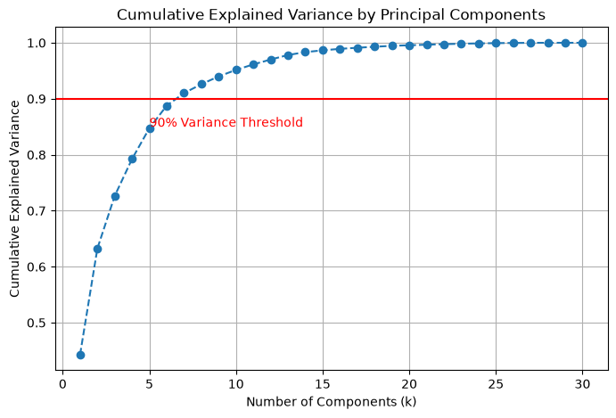

# Dimensionality Reduction with PCA 

This project demonstrates how **Principal Component Analysis (PCA)** can be used to reduce the dimensionality of a dataset while preserving most of its important information, and how the reduced feature set can be used to train a **Logistic Regression** classification model.

The project uses the **Breast Cancer Wisconsin Diagnostic Dataset** and compares the performance of a Logistic Regression model trained:

1. **Without PCA** (using all original features).
2. **With PCA** (using only the principal components required to retain approximately 90% of the original variance).

The project follows a complete machine learning workflow, including data preparation, feature scaling, dimensionality reduction, model training, performance evaluation, comparison of results, and prediction of previously unseen samples.

#### Key Features of the Project

- Loading and exploring the Breast Cancer dataset.
- Understanding why dimensionality reduction is important.
- Standardizing feature values using `StandardScaler`.
- Applying Principal Component Analysis (PCA).
- Analysing explained variance using a cumulative variance plot.
- Determining the optimal number of principal components.
- Reducing 30 original features to only 7 principal components.
- Training a Logistic Regression model using PCA-transformed data.
- Training a Logistic Regression model without PCA.
- Comparing classification performance between both approaches.
- Evaluating models using accuracy, confusion matrices, and classification reports.
- Predicting the class of previously unseen samples.
- Demonstrating how PCA can simplify machine learning models while maintaining high predictive performance.

---

## Project Structure

```text
dimensionality-reduction-with-pca/

│
├── 1. dimensionality reduction with PCA.ipynb
├── 2. logistic regression model training with PCA.ipynb
├── 3. logistic regression model training without PCA.ipynb
├── assets/
│   ├── breast_cancer_dataset.csv
│   └── logo.png
│   └── cumulative-explained-variance-by-principle-components.png
│
├── LICENSE.txt
├── requirements.txt
├── .gitignore
└── README.md
```

---

# Dataset

The project uses the **Breast Cancer Wisconsin Diagnostic Dataset**.

The dataset contains measurements extracted from digitized images of breast mass cell nuclei and is commonly used for binary classification tasks in machine learning.

The dataset contains:

| Property | Value |
|----------|--------:|
| Total Samples | 569 |
| Original Features | 30 |
| Target Classes | 2 |
| Classification Type | Binary Classification |

### Target Classes

| Class | Meaning |
|---------|---------|
| Benign | Non-cancerous tumour |
| Malignant | Cancerous tumour |

The target column is stored as:

```text
target
```

where:

```text
False = Benign
True  = Malignant
```

---

# Understanding Principal Component Analysis (PCA)

**Principal Component Analysis (PCA)** is a dimensionality reduction technique used to transform a large set of correlated features into a smaller set of uncorrelated variables called **Principal Components**.

The goal of PCA is to:

- Reduce the number of features.
- Remove redundant information.
- Minimize computational complexity.
- Reduce noise.
- Preserve as much information (variance) as possible.

Instead of using all 30 original features, PCA creates new features called principal components that capture the most important patterns in the data.

The overall PCA workflow can be represented as:

```text
Original Dataset (30 Features)
            ↓
     Standardization
            ↓
 Principal Component Analysis
            ↓
  Principal Components
            ↓
  Reduced Feature Dataset
            ↓
 Machine Learning Model
```

---

# Project Workflow

The repository consists of three major stages:

### Stage 1 - PCA Analysis

1. Load the Breast Cancer dataset.
2. Remove the target column.
3. Standardize the feature values.
4. Apply PCA using all 30 components.
5. Calculate explained variance.
6. Generate the cumulative explained variance graph.
7. Determine the minimum number of components required to preserve approximately 90% of the variance.

### Stage 2 - Logistic Regression with PCA

1. Load the dataset.
2. Separate features and target variables.
3. Encode target labels.
4. Split the dataset into training and testing sets.
5. Standardize the feature values.
6. Apply PCA retaining 90% variance.
7. Train Logistic Regression using the reduced feature set.
8. Evaluate performance.
9. Predict unknown samples.

### Stage 3 - Logistic Regression without PCA

1. Load the dataset.
2. Separate features and target variables.
3. Encode target labels.
4. Split the dataset into training and testing sets.
5. Train Logistic Regression using all original features.
6. Evaluate performance.
7. Predict unknown samples.

---

# Standardizing the Dataset

Before applying PCA, all feature values are standardized using:

```python
StandardScaler()
```

Standardization transforms each feature so that:

```text
Mean ≈ 0
Standard Deviation ≈ 1
```

This step is essential because PCA is highly sensitive to feature scales.

Without standardization:

- Features with larger numerical values dominate the analysis.
- Principal components become biased.
- Variance calculations become misleading.

---

# Applying Principal Component Analysis

PCA is first fitted using all 30 components:

```python
PCA(n_components=30)
```

This allows us to examine how much variance is explained by each component.

The transformed dataset has:

```text
Original Shape: (569, 30)

PCA Shape: (569, 30)
```

At this stage, no dimensionality reduction has occurred yet.

The purpose is to analyse variance preservation.

---

# Explained Variance Analysis

The cumulative explained variance graph is generated using:

```python
np.cumsum(pca.explained_variance_ratio_)
```



This graph shows how much information is retained as more principal components are included.

A reference line is added at:

```text
90% Explained Variance
```

to identify the number of components required to preserve most of the original information.

### Result

The analysis shows that:

```text
7 Principal Components
```

are sufficient to retain approximately:

```text
90% of the original dataset variance
```

Therefore:

```python
PCA(n_components=0.90)
```

automatically selects:

```text
7 Components
```

instead of the original:

```text
30 Features
```

This represents a dimensionality reduction of:

```text
30 → 7 Features
```

which is approximately:

```text
76.7% Feature Reduction
```

---

# Logistic Regression Model with PCA

After dimensionality reduction, the Logistic Regression model is trained using only the selected principal components.

The PCA configuration is:

```python
PCA(n_components=0.90)
```

The Logistic Regression configuration is:

```python
LogisticRegression(
    solver="liblinear",
    max_iter=1000
)
```

### PCA Configuration

| Parameter | Value | Purpose |
|-----------|--------|---------|
| n_components | 0.90 | Retain at least 90% variance |
| Selected Components | 7 | Automatically chosen by PCA |

### Logistic Regression Configuration

| Parameter | Value | Purpose |
|-----------|--------|---------|
| solver | liblinear | Suitable for binary classification |
| max_iter | 1000 | Allows sufficient iterations for convergence |

---

# Logistic Regression without PCA

A second Logistic Regression model is trained directly on the original dataset using all 30 features.

No dimensionality reduction is applied.

The same Logistic Regression configuration is used:

```python
LogisticRegression(
    solver="liblinear",
    max_iter=1000
)
```

This provides a baseline for comparison.

---

# Dataset Splitting

The dataset is divided into:

```python
train_test_split(
    test_size=0.20,
    random_state=42
)
```

The resulting datasets are:

| Dataset | Samples |
|----------|---------:|
| Training | 455 |
| Testing | 114 |
| Total | 569 |

---

# Model Evaluation

Both models are evaluated using:

- Accuracy
- Confusion Matrix
- Classification Report
- Precision
- Recall
- F1-Score

---

# Logistic Regression with PCA Results

### Model Accuracy

```text
98.25%
```

### Confusion Matrix

```text
[[70  1]
 [ 1 42]]
```

### Classification Report

| Class | Precision | Recall | F1-Score |
|---------|----------:|----------:|----------:|
| Benign | 0.99 | 0.99 | 0.99 |
| Malignant | 0.98 | 0.98 | 0.98 |

The model correctly classified:

```text
112 out of 114 samples
```

while using only:

```text
7 Principal Components
```

---

# Logistic Regression without PCA Results

### Model Accuracy

```text
95.61%
```

### Confusion Matrix

```text
[[70  1]
 [ 4 39]]
```

### Classification Report

| Class | Precision | Recall | F1-Score |
|---------|----------:|----------:|----------:|
| Benign | 0.95 | 0.99 | 0.97 |
| Malignant | 0.97 | 0.91 | 0.94 |

The model correctly classified:

```text
109 out of 114 samples
```

using:

```text
All 30 Original Features
```

---

# PCA vs Non-PCA Comparison

| Metric | With PCA | Without PCA |
|----------|---------:|---------:|
| Original Features | 30 | 30 |
| Features Used for Training | 7 | 30 |
| Feature Reduction | 76.7% | 0% |
| Testing Accuracy | 98.25% | 95.61% |
| Correct Predictions | 112 | 109 |
| Incorrect Predictions | 2 | 5 |

### Observation

Despite reducing the feature count from:

```text
30 → 7
```

the PCA-based model achieved:

```text
Higher Accuracy
Higher Recall
Higher F1-Score
```

than the model trained on all original features.

This demonstrates that dimensionality reduction can remove redundant information while preserving the most informative patterns in the dataset.

---

# Predicting Unknown Data

Both trained models are used to predict previously unseen samples.

Example predictions:

| Sample | Prediction |
|----------|-----------|
| Unknown Sample 1 | Malignant |
| Unknown Sample 2 | Benign |

This demonstrates how trained machine learning models can be applied to new real-world observations.

---

# Model Performance Summary

| Metric | PCA Model | Non-PCA Model |
|----------|----------:|----------:|
| Original Features | 30 | 30 |
| Components Used | 7 | 30 |
| Accuracy | 98.25% | 95.61% |
| Testing Samples | 114 | 114 |
| Benign F1-Score | 0.99 | 0.97 |
| Malignant F1-Score | 0.98 | 0.94 |

The results demonstrate that PCA successfully reduced the dimensionality of the dataset while preserving the majority of the useful information required for classification.

---

# Used Technologies

- Python
- Pandas
- NumPy
- Scikit-learn
- Matplotlib
- Jupyter Notebook

### Machine Learning Techniques

- Binary Classification
- Principal Component Analysis (PCA)
- Dimensionality Reduction
- Feature Scaling
- Logistic Regression
- Train-Test Split
- Confusion Matrix
- Classification Report

### Used Integrated Development Environment

- VS Code

---

# How to Use?

Clone this repository:

```bash
git clone https://github.com/PubuduJ/dimensionality-reduction-with-pca.git
```

Navigate to the project directory:

```bash
cd dimensionality-reduction-with-pca
```

Install the required dependencies:

```bash
pip install -r requirements.txt
```

or:

```bash
pip install pandas numpy matplotlib scikit-learn
```

Open the notebooks using Jupyter Notebook, JupyterLab, VS Code, or your preferred IDE.

Run the notebooks sequentially:

1. dimensionality reduction with PCA.ipynb
2. logistic regression model training with PCA.ipynb
3. logistic regression model training without PCA.ipynb

---

# Learning Outcomes

This project demonstrates how to:

- Understand the concept of dimensionality reduction.
- Understand the importance of feature scaling before PCA.
- Apply Principal Component Analysis using Scikit-learn.
- Interpret explained variance ratios.
- Determine an appropriate number of principal components.
- Reduce feature dimensionality while preserving information.
- Train Logistic Regression classification models.
- Compare machine learning performance before and after PCA.
- Evaluate models using confusion matrices and classification reports.
- Interpret precision, recall, and F1-scores.
- Predict previously unseen data samples.
- Understand the impact of PCA on classification performance.

---

# Version

**v1.0.0**

---

# License

Copyright &copy; 2026 [**Pubudu Janith**](https://www.linkedin.com/in/pubudujanith/). All Rights Reserved.

This project is licensed under the [**MIT License**](LICENSE.txt).